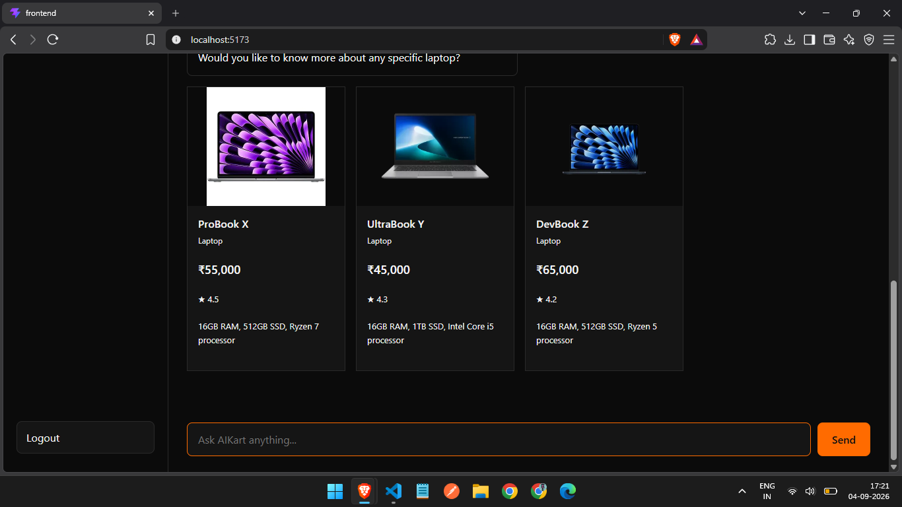
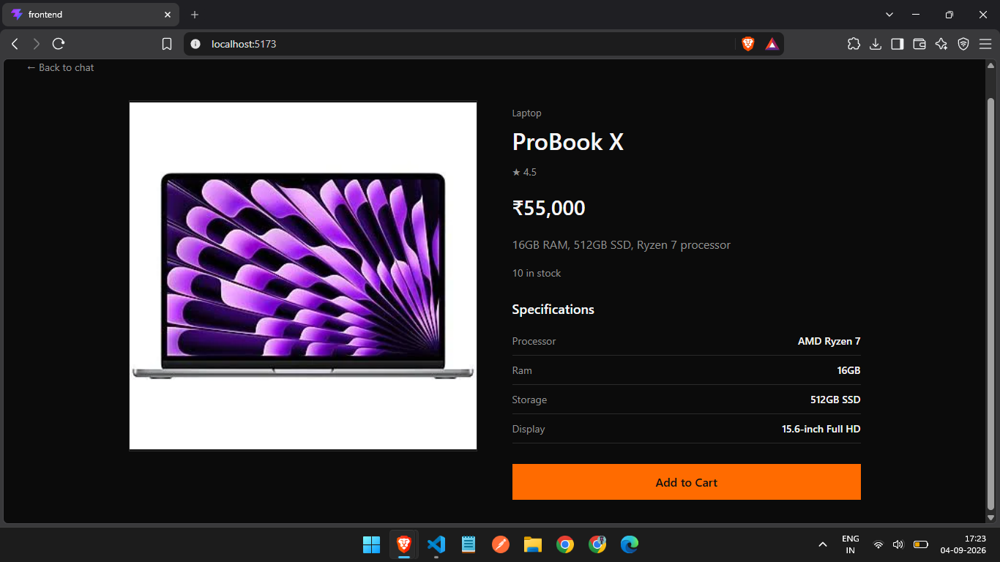
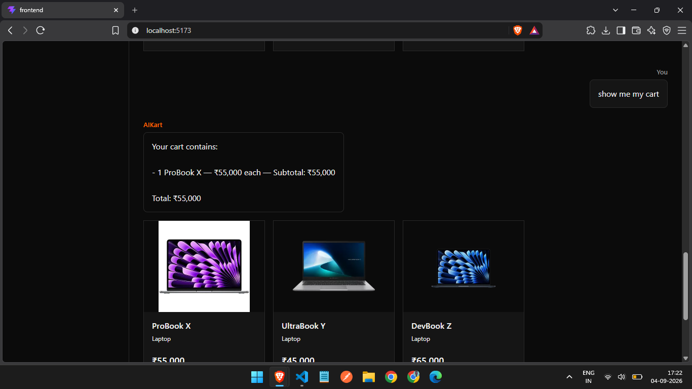

# AIKart

AIKart is an AI-powered conversational shopping agent built for Razorpay's **AI Growth & Agentic Commerce** track.

It allows customers to discover products, inspect product details, and manage a shopping cart through natural-language conversation.

The core design principle is:

> **The LLM is the interface, not the authority.**

Product data, pricing, stock, cart state, checkout state, and payment verification are controlled by the backend.

## What problem does AIKart solve?

Traditional shopping interfaces require users to navigate through categories, filters, product pages, and checkout screens.

AIKart explores a conversational alternative.

For example:

> "Show me laptops"

The agent interprets the request and presents relevant products. The customer can then select a product, inspect its details, add it to the cart, and ask for the current cart through conversation.

The project is designed to extend this experience toward agentic commerce while keeping financial actions controlled by deterministic backend logic.

## Current Working Flow

The currently demonstrated frontend flow is:

```text
User
  │
  │ "Show me laptops"
  ▼
AIKart
  │
  ├── ProBook X
  ├── UltraBook Y
  └── DevBook Z
        │
        │ User selects a product
        ▼
Product Details
        │
        │ Add to Cart
        ▼
Backend Cart
        │
        │ "Show me my cart"
        ▼
Cart Contents + Total
```

## Product Demo

### 1. Conversational Product Discovery

AIKart can interpret a natural-language request such as "show me laptops" and return relevant catalog products as interactive product cards.



### 2. Product Details

Selecting a product opens a dedicated product details view with price, rating, stock, specifications, and an Add to Cart action.



### 3. Conversational Cart

After adding a product, the customer can ask AIKart to show the current cart. Cart contents, subtotals, and the total are returned from backend-controlled cart state.



## Architecture

```text
                         Customer
                            │
                            ▼
                     React Frontend
                            │
                            ▼
                     Express Backend
                            │
              ┌─────────────┼─────────────┐
              │             │             │
              ▼             ▼             ▼
          Session        Catalog         Cart
            State        & Search        State
              │             │             │
              └─────────────┼─────────────┘
                            │
                            ▼
                           LLM
                         Qwen2.5
                            │
                            ▼
                     Tool Execution
                            │
                            ▼
                  Deterministic Commerce
                       Logic Layer
                            │
                   ┌────────┴────────┐
                   │                 │
                   ▼                 ▼
               Checkout           Payment
                   │                 │
                   │                 ▼
                   │             Razorpay
                   │
                   ▼
              Audit Events
```

### Authority boundaries

The LLM is used for language understanding and tool selection. It is not trusted with authoritative commerce decisions.

The backend controls:

- Product information
- Product prices
- Stock
- Cart state
- Checkout state
- Payment state
- Payment verification

This prevents model-generated text from becoming the source of truth for a financial transaction.

## Implemented Features

### Conversational Product Discovery

- Natural-language product search
- Catalog-aware product matching
- Category-aware searches
- Budget constraints
- Product results returned safely to the frontend

### Product Details

- Product images
- Category
- Price
- Rating
- Description
- Stock information
- Product specifications

### Cart

- Add products to cart
- Increment quantities
- Remove products
- Stock-limit enforcement
- Cumulative stock validation
- Backend-authoritative prices and totals
- Session-specific cart state
- Conversational cart viewing

### Session and Conversation State

- Persistent frontend session ID
- Conversation history
- Session isolation
- Contextual product references

### Checkout

The backend contains:

- Checkout session state
- Checkout snapshots
- Human confirmation state
- Controlled checkout state transitions
- Protection against stale confirmations

### Payments

The backend contains Razorpay Test Mode integration including:

- Razorpay order creation
- Payment state management
- Payment failure handling
- Payment cancellation
- Payment retry handling
- Server-side payment verification
- Payment creation idempotency

### Audit Logging

The backend records important commerce lifecycle events, including checkout confirmation and payment lifecycle events.

## What Broke and How I Got Out

One of the main engineering challenges was separating LLM reasoning from deterministic commerce behavior.

As the search capabilities became more flexible, the LLM could generate search arguments that were technically valid but too restrictive for the intended customer request.

This could cause the deterministic catalog search to return no products even when matching products existed.

The solution was to avoid making the LLM the authority over product matching.

The architecture became:

```text
Natural-language request
        │
        ▼
       LLM
        │
        ▼
Structured search intent
        │
        ▼
Backend search logic
        │
        ▼
Merchant catalog
```

This made product selection more deterministic and testable.

The project also includes regression tests covering search behavior, product grounding, cart authorization, quantity validation, stock limits, session isolation, contextual product references, and other agent behaviors.

## Testing

The project contains automated regression tests for important agent and commerce behavior.

Covered areas include:

- Product discovery
- Search constraints
- Product information grounding
- Internal product ID protection
- Fabricated price protection
- Prompt-injection resistance
- Cart authorization
- Quantity validation
- Stock limits
- Cart state
- Conversation history
- Session isolation
- Contextual product references
- Product-name resolution

Run the backend test suite with:

```bash
cd backend
npm test
```

## Current Status

### Working in the frontend

- Conversational product discovery
- Product result cards
- Product details
- Product navigation
- Add to Cart
- Conversational cart viewing

### Implemented in the backend

- Cart operations
- Checkout state management
- Checkout snapshots
- Human confirmation state
- Razorpay Test Mode order creation
- Payment state management
- Payment verification
- Payment failure/cancellation/retry handling
- Payment idempotency
- Audit logging
- Regression testing

### Remaining

Due to the buildathon time constraint, the following frontend work remains:

- Dedicated cart UI
- Checkout review UI
- Complete Razorpay checkout frontend flow
- Payment success UI
- Payment failure/retry UI
- Audit trail UI
- Final frontend polish

The underlying checkout, payment, verification, retry, and audit infrastructure has been implemented in the backend, but the complete transaction journey has not yet been exposed through the frontend.

## Tech Stack

### Frontend

- React
- Vite
- JavaScript

### Backend

- Node.js
- Express
- Zod

### AI

- Ollama
- Qwen2.5

### Payments

- Razorpay Test Mode

### Testing

- Node.js built-in test runner

## Project Structure

```text
AIKart/
├── backend/
│   ├── commerce/
│   ├── data/
│   ├── payments/
│   ├── state/
│   ├── tools/
│   └── server.js
│
├── frontend/
│   └── src/
│       ├── api/
│       ├── components/
│       ├── session/
│       ├── App.jsx
│       └── App.css
│
├── tests/
│   ├── agent-regression.js
│   ├── session.test.js
│   └── agent-evaluation.md
│
├── .env.example
├── .gitignore
└── README.md
```

## Running Locally

### 1. Install backend dependencies

```bash
cd backend
npm install
```

### 2. Configure environment variables

Create a `.env` file in the project root:

```env
RAZORPAY_KEY_ID=your_test_key_id
RAZORPAY_KEY_SECRET=your_test_key_secret
```

Never commit the `.env` file.

### 3. Start the backend

```bash
cd backend
node server.js
```

### 4. Start the frontend

Open another terminal:

```bash
cd frontend
npm install
npm run dev
```

### 5. Run tests

```bash
cd backend
npm test
```

## Intended Complete Commerce Flow

The intended final experience is:

```text
Product Discovery
      ↓
Product Details
      ↓
Cart
      ↓
Checkout Review
      ↓
Human Confirmation
      ↓
Razorpay Payment
      ↓
Server-side Verification
      ↓
Payment Success
      ↓
Audit Trail
```

The goal is to make an AI shopping agent capable of assisting with commerce while ensuring every money-related action remains **explainable, bounded, and gated**.
